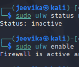
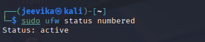
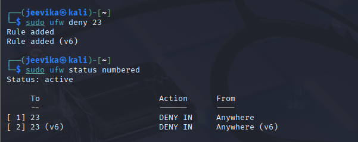
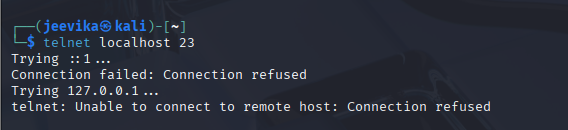
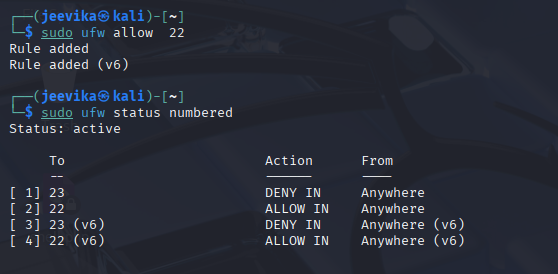
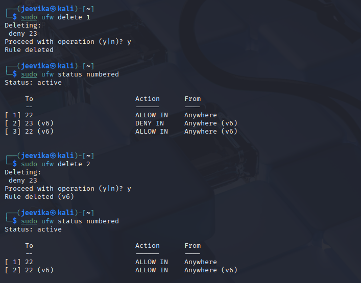
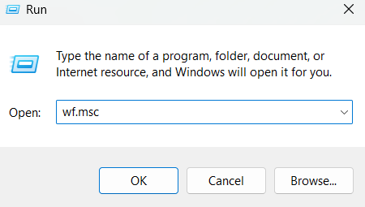
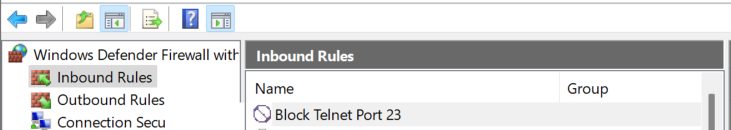
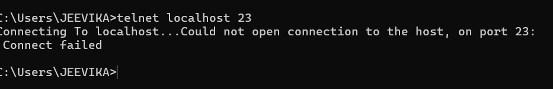

# 🔥 Firewall Configuration Task Documentation


## 🐧 Linux (Kali) Firewall: UFW

### ✅ Step 1: Enable Firewall
```bash
sudo ufw status
sudo ufw enable
```
> 🔍 

---

### ✅ Step 2: List Current Rules
```bash
sudo ufw status numbered
```
> 🔍 

---

### ✅ Step 3: Block Inbound Port 23 (Telnet)
```bash
sudo ufw deny 23
```
> 🔍 

---

### ✅ Step 4: Test Telnet Block
```bash
sudo apt install telnet
telnet localhost 23
```
> 🔍 

---

### ✅ Step 5: Allow SSH (Port 22)
```bash
sudo ufw allow 22
```
> 🔍 

---

### ✅ Step 6: Remove Telnet Block Rule
```bash
sudo ufw status numbered
sudo ufw delete 1
sudo ufw delete 2  # Again to remove the second IPv6 rule
```
> 🔍 

---

## 🪟 Windows Firewall

### ✅ Step 1: Open Firewall Configuration Tool
- Open Run → `wf.msc`
> 🔍 

---

### ✅ Step 2: Block Inbound Port 23 (Telnet)
1. Inbound Rules → New Rule → Port → TCP 23 → Block → Apply to all → Name: `Block Telnet`
> 🔍 

---

### ✅ Step 3: Test Port 23 (Telnet)
```cmd
telnet localhost 23
```
Expected output:
```
Could not open connection to the host, on port 23: Connect failed
```
> 🔍 

---

## 🧠 Summary: How Firewalls Filter Traffic

- **UFW** and **Windows Firewall** use rule-based systems to allow or deny traffic.
- Rules specify:
  - Port numbers
  - Protocol (TCP/UDP)
  - Direction (Inbound/Outbound)
  - Action (Allow/Deny)
- Firewalls help protect systems from unauthorized access or data exfiltration.

---

## 📁 Screenshot Folder Structure
```
screenshots/
├── linux_ufw_enabled.png
├── linux_ufw_rules_list.png
├── linux_block_port_23.png
├── linux_telnet_fail.png
├── linux_allow_ssh.png
├── linux_remove_port_23.png
├── windows_firewall_open.png
├── windows_block_telnet.png
├── windows_telnet_fail.png
```
